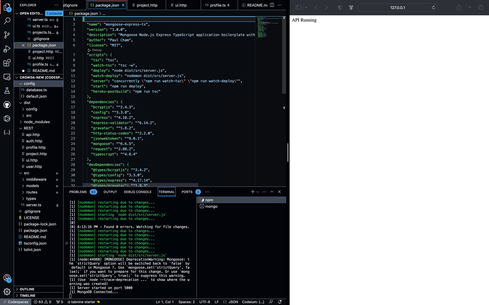

## BACKEND FOR MALAIKA CROWD-FUNDING
NB: BACKEND FOR MALAIKA CROWD-FUNDING does not include frontend files, so you have to communicate with it through the API.

## HOW TO COMMUNICATE WITH THE API
I suggest three ways to interact with the API:

1. Ideally through a frontend, for a production-ready environment

2.  I provided four python testers for you to test the API in case you don't have a frontend. You can find these files in the "python-tester" folder.
NB: Just run (for a file filename.py):

        python filename.py

(Windows) or 

        python3 filename.py

(Linux/MacOs) and follow along with the test prompts.

3. You can use a tool like Visual Studio Code's "REST Client" extension.
NB: Before you do any of these, you should first build the backend

## BUILDING THE BACKEND
first, run:

    cd malaika-backend 
    
NB: you can change "malaika-backend" to whatever name of the folder that contains this README.md

    npm install

    npm run tsc

# run the backend server

    npm run server

# build and run the project:

    npm run start

Finally, navigate to http://localhost:5000/ and you should see the API running!
NB: You should make requests to the API running in port http://localhost:5000/. 
  

## Making Requests
Read the contents of the [API-DIRECTIONS folder](./API-DIRECTIONS) for guides on making API requests.

## POST SCRIPTS
NB: Also, you need to have a running instance of mongodb either locally or online. If you are in a dev environment, you can easily achieve this by installing mongodb for your system and running it. 

In a production environment however, you might need to connect to an online instance.

PS:

1. Note that whatever database name you are using should replace the default "Projects" database I used in this url:   "mongoURI": "mongodb://localhost:27017/Projects", Check the "config/default.json".

2. Kudos to the owner of https://github.com/sunnysidelabs/mongoose-express-ts, which I used as boilerplate for this project.